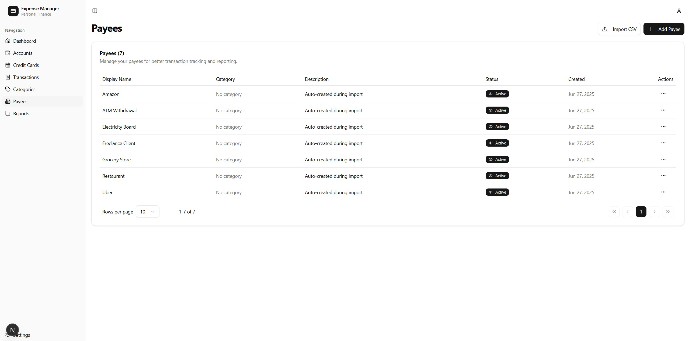
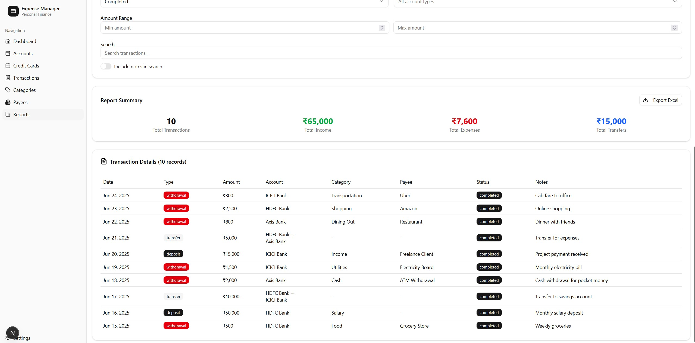

# 💰 Expense Manager App

A modern, full-featured personal expense management application built with Next.js, TypeScript, and Supabase. Track your income, expenses, and transfers across multiple accounts with powerful filtering, categorization, and advanced analytics features.

[](https://nextjs.org/)
[](https://www.typescriptlang.org/)
[](https://supabase.com/)
[](https://tailwindcss.com/)
[](https://nodejs.org/)
[](https://opensource.org/licenses/MIT)

> **🚀 Live Demo:** [View Demo](https://moneyx-b7vn.onrender.com)

## Table of Contents

- [Features](#-features)
- [Screenshots](#-screenshots)
- [Quick Start](#-quick-start)
- [Technology Stack](#️-technology-stack)
- [Project Structure](#-project-structure)
- [Usage Guide](#-usage-guide)
- [Available Scripts](#-available-scripts)
- [Environment Variables](#-environment-variables)
- [Deployment](#-deployment)
- [Contributing](#-contributing)
- [License](#-license)
- [Acknowledgments](#-acknowledgments)
- [Support & Documentation](#-support--documentation)

## ✨ Features

### 🏦 Account Management
- **Multiple Account Types**: Support for savings, checking, credit cards, investments, cash, loans, and other account types
- **Multi-Currency Support**: Track accounts in INR, USD, EUR, and GBP with automatic currency formatting
- **Advanced Credit Card Management**: 
  - Credit limit tracking with usage percentage calculations
  - Bill generation and payment due dates
  - Current bill status tracking (paid/unpaid)
  - Credit usage visualization with progress bars
- **Real-time Balance Updates**: Automatic balance calculations with transaction processing
- **Smart Sorting**: Accounts are automatically sorted by type first, then alphabetically by name for organized navigation
- **Account Status Management**: Active, inactive, and closed account states

### 💸 Transaction Management
- **Three Transaction Types**: 
  - **Deposits**: Income and money received
  - **Withdrawals**: Expenses and money spent
  - **Transfers**: Money moved between your accounts with dual-account tracking
- **Smart Categorization**: Organize expenses with custom categories and auto-creation during import
- **Payee Management**: Track who you pay or receive money from with detailed payee profiles
- **Transaction Status Tracking**: Pending, completed, and cancelled transaction states
- **Advanced Filtering & Search**: 
  - Multi-select accounts filter for viewing specific account transactions
  - Filter by transaction type, status, and date ranges
  - Full-text search across transaction notes and payee names
- **Bulk CSV Import**: Import transactions from CSV files with intelligent parsing and validation
- **Auto-Entity Creation**: Automatically create missing categories and payees during import

### 💳 Specialized Credit Card Features
- **Comprehensive Bill Management**: 
  - Automatic bill generation based on billing cycles
  - Bill status tracking (generated, paid, overdue, partial)
  - Payment tracking with partial payment support
- **Credit Card Dashboard**: 
  - Credit usage visualization with progress indicators
  - Available credit calculations
  - Next bill generation and payment due date notifications
- **Bill History & Analytics**: 
  - Complete bill history with payment records
  - Overdue and upcoming bill alerts
  - Credit utilization trends and insights
- **Payment Integration**: Mark bills as paid with transaction linking

### 📊 Advanced Reports & Analytics
- **Custom Report Builder**: 
  - Drag-and-drop interface for creating custom reports
  - Advanced filtering by accounts, categories, payees, and date ranges
  - Multiple chart types (bar, line, pie, area charts)
- **Financial Dashboards**: 
  - Real-time income vs expense tracking
  - Monthly and yearly trend analysis
  - Account balance summaries with change indicators
- **Visual Analytics**: 
  - Interactive charts with hover details
  - Responsive chart layouts for all device sizes
  - Export capabilities for reports and data
- **Performance Metrics**: 
  - Net income calculations
  - Spending pattern analysis by category
  - Account performance tracking

### 🔄 CSV Import & Export Features
- **Transaction Import**: 
  - Support for complex CSV formats with multiple columns
  - Intelligent date parsing (DD-MM-YYYY format)
  - Transfer transaction detection and processing
  - Validation with detailed error reporting
- **Category & Payee Bulk Import**: 
  - CSV import for categories and payees
  - Duplicate detection and prevention
  - Progress tracking with real-time updates
  - Sample CSV template downloads
- **Error Handling & Validation**: 
  - Comprehensive validation for all imported data
  - Preview mode before final import
  - Detailed error messages for failed entries
  - Batch processing with progress indicators

### 🔐 Security & Privacy
- **User Authentication**: Secure login with Supabase Auth
- **Row Level Security**: Database-level data isolation between users
- **Protected Routes**: Secure access to all sensitive financial data
- **Data Encryption**: All sensitive data encrypted at rest
- **Session Management**: Automatic session handling with secure token management

### 🎨 Modern UI/UX
- **Responsive Design**: Seamless experience on desktop, tablet, and mobile devices
- **Dark/Light Mode**: Comfortable viewing in any lighting condition (system preference)
- **Accessible Design**: Built with accessibility best practices and ARIA support
- **Intuitive Interface**: Clean, modern design with excellent user experience
- **Enhanced Calendar**: Month and year selection with keyboard navigation
- **Loading States**: Smooth loading indicators and skeleton UI
- **Toast Notifications**: Real-time feedback for all user actions

### 🛠️ Advanced Technical Features
- **Real-time Updates**: Automatic balance recalculation on transaction changes
- **Database Functions**: Custom PostgreSQL functions for complex calculations
- **Optimized Queries**: Efficient database queries with proper indexing
- **Type Safety**: Full TypeScript implementation with comprehensive type definitions
- **Form Validation**: Advanced form validation with Zod schemas
- **Error Boundaries**: Graceful error handling throughout the application

## 📸 Screenshots

### Dashboard


### Accounts Management


### Transaction Management


### Categories & Payees



### Reports & Analytics



## 🚀 Quick Start

### Prerequisites

- **Node.js** 20.19.2 or higher
- **npm** or **yarn** package manager
- **Supabase** account and project

### Installation

1. **Clone the repository**
   ```bash
   git clone https://github.com/your-username/expense-manager-app.git
   cd expense-manager-app
   ```
   
   Or using GitHub CLI:
   ```bash
   gh repo clone your-username/expense-manager-app
   ```

2. **Install dependencies**
   ```bash
   npm install
   # or
   yarn install
   ```

3. **Set up environment variables**
   
   Create a `.env.local` file in the root directory:
   ```env
   NEXT_PUBLIC_SUPABASE_URL=your_supabase_project_url
   NEXT_PUBLIC_SUPABASE_ANON_KEY=your_supabase_anon_key
   ```

4. **Set up the database**
   
   Run the SQL schema in your Supabase SQL editor:
   ```bash
   # Copy the contents of src/lib/database-schema.sql
   # and execute it in your Supabase project's SQL editor
   ```

5. **Start the development server**
   ```bash
   npm run dev
   # or
   yarn dev
   ```

6. **Open your browser**
   
   Navigate to [http://localhost:3000](http://localhost:3000)

## 🛠️ Technology Stack

### Frontend
- **[Next.js 15.3.4](https://nextjs.org/)** - React framework with App Router
- **[TypeScript](https://www.typescriptlang.org/)** - Type-safe JavaScript with comprehensive type definitions
- **[Tailwind CSS 4.1.10](https://tailwindcss.com/)** - Utility-first CSS framework
- **[Radix UI](https://www.radix-ui.com/)** - Accessible component primitives
- **[Shadcn/ui](https://ui.shadcn.com/)** - Beautiful, customizable component library

### Backend & Database
- **[Supabase](https://supabase.com/)** - Backend-as-a-Service with PostgreSQL
- **[PostgreSQL](https://www.postgresql.org/)** - Robust relational database with custom functions
- **Row Level Security** - Database-level security policies for data isolation

### Form Management & Validation
- **[React Hook Form](https://react-hook-form.com/)** - Performant forms with easy validation
- **[Zod](https://zod.dev/)** - TypeScript-first schema validation
- **[@hookform/resolvers](https://github.com/react-hook-form/resolvers)** - Validation resolver integration

### Data Visualization & Analytics
- **[Recharts](https://recharts.org/)** - Powerful chart library for React
- **[date-fns](https://date-fns.org/)** - Modern JavaScript date utility library
- **Custom Report Builder** - Advanced reporting with drag-and-drop interface

### UI Components & Icons
- **[Lucide React](https://lucide.dev/)** - Beautiful & consistent icon set
- **[cmdk](https://cmdk.paco.me/)** - Command palette component
- **[Sonner](https://sonner.emilkowal.ski/)** - Toast notifications
- **[React Day Picker](https://react-day-picker.js.org/)** - Date picker component

### File Processing
- **[XLSX](https://sheetjs.com/)** - Excel and CSV file processing library
- **CSV Parser** - Custom CSV parsing with validation and error handling

## 📁 Project Structure

```
expense-manager-app/
├── src/
│   ├── app/                    # Next.js App Router pages
│   │   ├── accounts/          # Account management page
│   │   ├── categories/        # Category management page with CSV import
│   │   ├── credit-cards/      # Credit card bill management page
│   │   ├── dashboard/         # Main dashboard with analytics
│   │   ├── payees/           # Payee management page with CSV import
│   │   ├── reports/          # Advanced reports and analytics
│   │   └── transactions/     # Transaction management with import
│   ├── components/            # Reusable React components
│   │   ├── accounts/         # Account-specific components
│   │   ├── auth/             # Authentication components
│   │   ├── categories/       # Category components with CSV import
│   │   ├── dashboard/        # Dashboard summary cards and charts
│   │   ├── layout/           # Layout components with navigation
│   │   ├── payees/           # Payee components with CSV import
│   │   ├── reports/          # Advanced report builder components
│   │   ├── transactions/     # Transaction components with import
│   │   └── ui/               # Base UI components (shadcn/ui)
│   ├── hooks/                # Custom React hooks for data management
│   ├── lib/                  # Utility libraries and configurations
│   │   ├── services/         # API service functions for all entities
│   │   └── validations/      # Zod validation schemas
│   └── types/                # TypeScript type definitions
│       ├── account.ts        # Account and credit card types
│       ├── category.ts       # Category management types
│       ├── credit-card.ts    # Credit card bill management types
│       ├── payee.ts          # Payee management types
│       ├── report.ts         # Report and analytics types
│       └── transaction.ts    # Transaction types with import support
├── public/                   # Static assets and sample files
└── docs/                     # Documentation files
```

## 🎯 Usage Guide

### Managing Accounts
1. Navigate to **Accounts** page
2. Click **Add Account** to create new accounts
3. Configure account type, currency, and initial balance
4. For **credit cards**, set credit limits, bill generation dates, and payment due dates
5. View real-time credit usage with visual progress indicators
6. Accounts are automatically sorted by type, then alphabetically for organized browsing

### Recording Transactions
1. Go to **Transactions** page
2. Click **Add Transaction**
3. Choose transaction type:
   - **Deposit**: Money coming in (income, refunds, etc.)
   - **Withdrawal**: Money going out (expenses, purchases, etc.)
   - **Transfer**: Moving money between your accounts
4. Fill in details including payee, category, and notes
5. Categories and payees can be created on-the-fly during transaction entry

### Advanced Filtering & Search
- Use the **search bar** to find specific transactions by description or payee
- Filter by **transaction type** (deposit, withdrawal, transfer)
- Filter by **status** (completed, pending, cancelled)
- Use **multi-select accounts filter** to view transactions from specific accounts
- Apply **date range filters** for historical analysis

### Categories & Payees Management
- Create **categories** to organize your expenses with descriptions
- Add **payees** to track who you transact with
- Use **CSV import** for bulk creation of categories and payees
- Set active/inactive status for better organization
- Auto-complete suggestions when entering transactions

### CSV Import Capabilities

#### Transaction Import
1. Navigate to **Transactions** page
2. Click **Import CSV** button
3. Select your transaction CSV file
4. Review the import preview showing:
   - Valid transactions to be imported
   - Transfer transactions (detected by payee starting with ">")
   - Validation errors with detailed messages
5. Configure import options:
   - Create missing categories automatically
   - Create missing payees automatically
   - Skip duplicate transactions
6. Monitor real-time progress during import
7. Review comprehensive import results

#### Category & Payee Import
1. Navigate to **Categories** or **Payees** page
2. Click **Import CSV** button
3. Download sample CSV template if needed
4. Select your CSV file (must have .csv extension)
5. Review the import preview showing:
   - Valid entries to be imported
   - Duplicate entries (will be skipped)
   - Invalid entries with error messages
6. Click **Import** to process the file
7. Monitor progress with real-time progress bar
8. Review import results summary

**CSV Format Requirements:**
- **Categories**: 2-50 characters, letters, numbers, spaces, and common punctuation
- **Payees**: 2-100 characters, similar character restrictions
- **Transactions**: Support for complex CSV with Date (DD-MM-YYYY), Account, Payee, Category, Withdrawal, Deposit columns
- Optional header rows are automatically detected and skipped

### Credit Card Management
1. Create credit card accounts with credit limits and billing dates
2. View **Credit Cards** page for comprehensive bill management
3. Monitor credit usage with visual progress indicators
4. Track upcoming bill generation and payment due dates
5. View bill history with payment tracking
6. Mark bills as paid with automatic status updates
7. Get alerts for overdue and upcoming payments

### Advanced Reports & Analytics
1. Navigate to **Reports** page
2. Use the **Custom Report Builder** to:
   - Select date ranges for analysis
   - Filter by specific accounts, categories, or payees
   - Choose from multiple chart types (bar, line, pie, area)
   - Create income vs expense comparisons
3. View **Dashboard** for quick financial overview:
   - Total balance across all accounts
   - Monthly income and expense summaries
   - Recent transaction highlights
   - Interactive charts with trend analysis

## 🔧 Available Scripts

```bash
# Development
npm run dev          # Start development server with hot reload
npm run build        # Build optimized production bundle
npm run start        # Start production server
npm run lint         # Run ESLint for code quality

# Type checking
npx tsc --noEmit     # Check TypeScript types without compilation
```

## 🌐 Environment Variables

Create a `.env.local` file with the following variables:

```env
# Supabase Configuration (Required)
NEXT_PUBLIC_SUPABASE_URL=your_supabase_project_url
NEXT_PUBLIC_SUPABASE_ANON_KEY=your_supabase_anon_key

# Optional: Custom configuration
NEXT_PUBLIC_APP_URL=http://localhost:3000
```

## 🚀 Deployment

### Deploy on Vercel (Recommended)

1. Push your code to GitHub
2. Connect your repository to [Vercel](https://vercel.com)
3. Set environment variables in Vercel dashboard
4. Deploy automatically on every push
5. Configure Supabase URL in production environment

### Deploy on Netlify

1. Build the application: `npm run build`
2. Deploy the `out` folder to Netlify
3. Configure environment variables in Netlify dashboard
4. Set up continuous deployment from GitHub

### Self-Hosted Deployment

1. Build the application: `npm run build`
2. Start the production server: `npm run start`
3. Configure reverse proxy (nginx/Apache) for domain routing
4. Set up SSL certificates for secure connections
5. Configure database connection for production

## 🤝 Contributing

We welcome contributions! Please follow these steps:

1. **Fork the repository**
2. **Create a feature branch**
   ```bash
   git checkout -b feature/amazing-feature
   ```
3. **Make your changes**
   - Follow the existing code style and patterns
   - Add comprehensive comments and documentation
   - Include type definitions for TypeScript
4. **Commit your changes**
   ```bash
   git commit -m 'Add amazing feature with detailed description'
   ```
5. **Push to the branch**
   ```bash
   git push origin feature/amazing-feature
   ```
6. **Open a Pull Request**

### Development Guidelines

- Follow **TypeScript best practices** with strict type checking
- Use **meaningful commit messages** following conventional commits
- Add **comprehensive tests** for new features
- Update **documentation** as needed, including inline comments
- Follow the **existing code style** with proper formatting
- Ensure **accessibility compliance** in UI components
- **Performance considerations** for large datasets and CSV imports

## 📝 License

This project is licensed under the MIT License - see the [LICENSE](LICENSE) file for details.

## 🙏 Acknowledgments

- **[Next.js](https://nextjs.org/)** for the powerful React framework with App Router
- **[Supabase](https://supabase.com/)** for the comprehensive backend infrastructure
- **[Shadcn/ui](https://ui.shadcn.com/)** for the beautiful and accessible component library
- **[Radix UI](https://www.radix-ui.com/)** for the foundational accessible primitives
- **[Recharts](https://recharts.org/)** for the powerful data visualization capabilities
- **[Vercel](https://vercel.com/)** for hosting and deployment platform

## 🆕 Recent Updates & Features

### Latest Major Features
- **Advanced Credit Card Management**: Complete bill tracking, payment management, and usage analytics
- **Custom Report Builder**: Drag-and-drop interface for creating detailed financial reports
- **Enhanced CSV Import System**: 
  - Bulk transaction import with intelligent parsing
  - Category and payee import with validation
  - Progress tracking and comprehensive error handling
- **Real-time Dashboard Analytics**: Interactive charts with income vs expense tracking
- **Multi-Account Transfer Support**: Seamless money transfers between accounts
- **Advanced Filtering System**: Multi-select filters for accounts, categories, and payees

### Performance & UX Improvements
- **Optimized Database Queries**: Custom PostgreSQL functions for complex calculations
- **Enhanced Form Validation**: Comprehensive Zod schemas with real-time validation
- **Improved Mobile Experience**: Responsive design optimized for all device sizes
- **Loading State Management**: Skeleton UI and smooth loading indicators
- **Error Boundary Implementation**: Graceful error handling throughout the application
- **Type Safety**: Complete TypeScript implementation with strict type checking

### Security Enhancements
- **Row Level Security**: Database-level data isolation between users
- **Enhanced Authentication**: Secure session management with Supabase Auth
- **Data Validation**: Server-side validation for all user inputs
- **Protected Routes**: Comprehensive route protection for sensitive data

## 📞 Support & Documentation

If you have any questions or need help:

- 💬 **Issues**: [GitHub Issues](https://github.com/your-username/expense-manager-app/issues)
- 📖 **Documentation**: [Wiki](https://github.com/your-username/expense-manager-app/wiki)
- 🚀 **Feature Requests**: Use GitHub Issues with the "enhancement" label
- 💡 **Discussions**: [GitHub Discussions](https://github.com/your-username/expense-manager-app/discussions)
- 📧 **Email**: [your-email@example.com](mailto:your-email@example.com)

### Troubleshooting Common Issues

- **CSV Import Failures**: Check file format and column headers match expected format
- **Database Connection Issues**: Verify Supabase credentials and network connectivity
- **Transaction Validation Errors**: Ensure all required fields are properly filled
- **Credit Card Calculations**: Verify credit limit and transaction amounts are correct

---

<div align="center">
  <p>Made with ❤️ for better financial management</p>
  <p>⭐ Star this repo if you find it helpful!</p>
  <p><strong>Built with modern technologies for a seamless expense tracking experience</strong></p>
</div>
